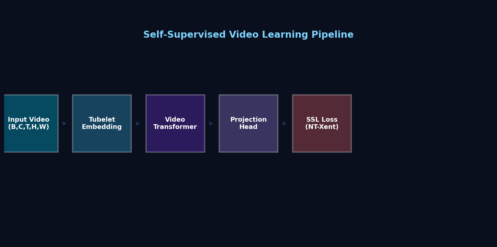
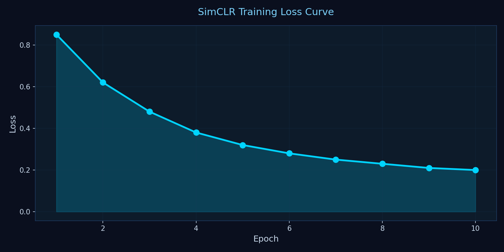
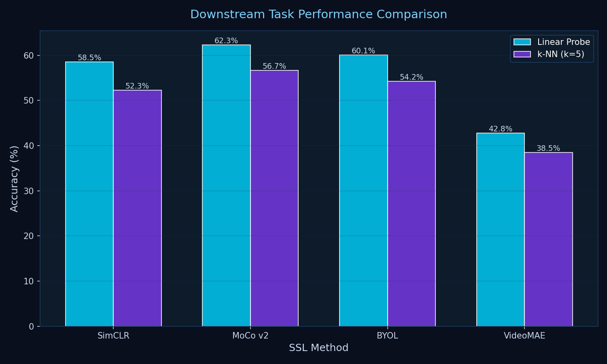
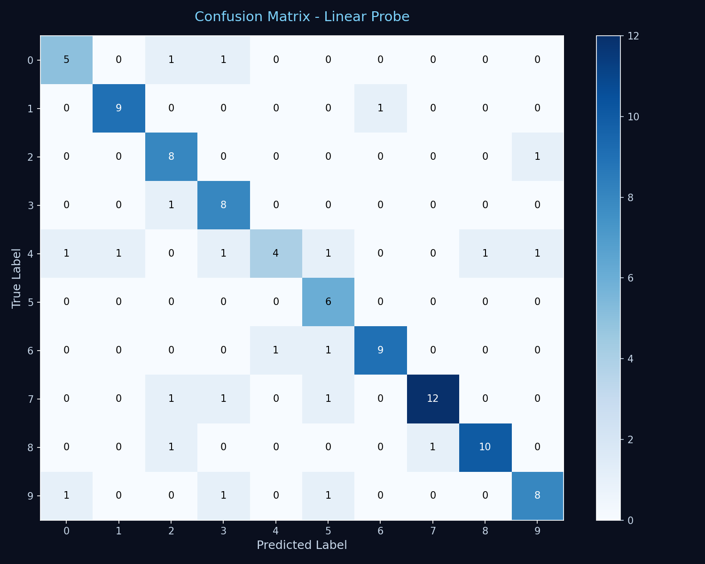
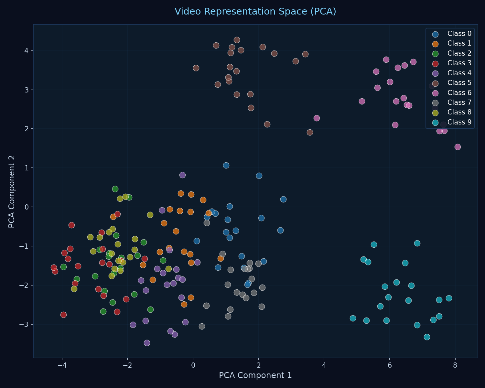
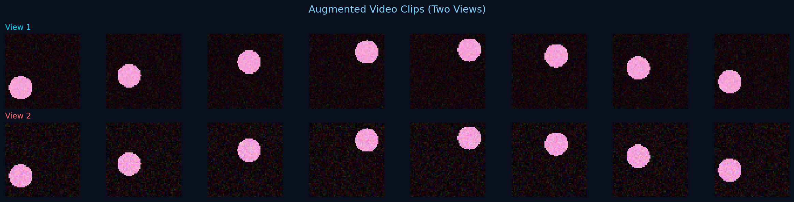

# 🎬 Self-Supervised Video Learning

[](https://python.org)
[](https://pytorch.org)
[](https://streamlit.io)
[](LICENSE)

**Self-supervised video representation learning** with SimCLR, MoCo v2, BYOL, and VideoMAE. Interactive Streamlit UI for training, evaluation, and visualization.



---

## 🚀 Quick Start

```bash
# Install & Run
pip install -r requirements.txt
streamlit run app.py
```

**Deploy to Streamlit Cloud:**
1. Push to GitHub
2. Go to [share.streamlit.io](https://share.streamlit.io)
3. Click "New app" → Select repo → Set `app.py` → Deploy

---

## ✨ Features

🎯 **4 SSL Methods** • 🧠 **Video Transformer** • 📊 **Real-time Training** • 🔬 **Feature Visualization** • 📈 **Evaluation Metrics**

---

## 📊 Results

<table>
<tr>
<td></td>
<td></td>
</tr>
<tr>
<td></td>
<td></td>
</tr>
</table>



---

## 🏗️ Architecture

| Method | Strategy | Key Feature |
|--------|----------|-------------|
| **SimCLR** | Contrastive | NT-Xent loss |
| **MoCo v2** | Contrastive | Momentum encoder |
| **BYOL** | Predictive | No negatives |
| **VideoMAE** | Reconstructive | 75% masking |

---

## 📁 Structure

```
├── app.py              # Complete application
├── requirements.txt    # Dependencies
├── .streamlit/         # Config
└── screenshots/        # Visualizations
```

---

## 🎮 Usage

**Interactive UI:**
1. Configure parameters in sidebar
2. Click "🚀 Train Model"
3. Click "📊 Run Evaluation"
4. Explore visualizations

**Programmatic:**
```python
from app import build_model, SyntheticVideoDataset

model = build_model('simclr', img_size=64, num_frames=8)
dataset = SyntheticVideoDataset(num_videos=200)
```

---

## ⚙️ Configuration

| Parameter | Default | Options |
|-----------|---------|---------|
| Method | simclr | simclr, moco, byol, videomae |
| Resolution | 64 | 32, 64, 128 |
| Frames | 8 | 4, 8, 16 |
| Embed Dim | 192 | 96, 192, 384 |
| Depth | 4 | 2-8 |
| Epochs | 6 | 2-30 |

---

## 📚 References

- **SimCLR**: [arXiv:2002.05709](https://arxiv.org/abs/2002.05709)
- **MoCo v2**: [arXiv:2003.04297](https://arxiv.org/abs/2003.04297)
- **BYOL**: [arXiv:2006.07733](https://arxiv.org/abs/2006.07733)
- **VideoMAE**: [arXiv:2203.12602](https://arxiv.org/abs/2203.12602)

---

## 📄 License

MIT License - see [LICENSE](LICENSE)

**Made with ❤️ using PyTorch & Streamlit**
